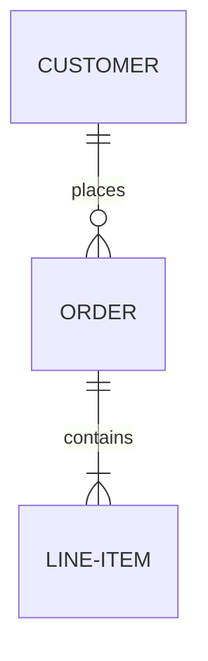
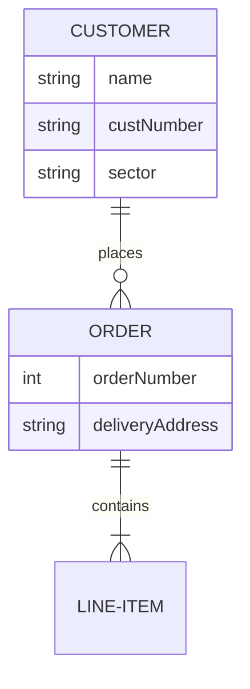
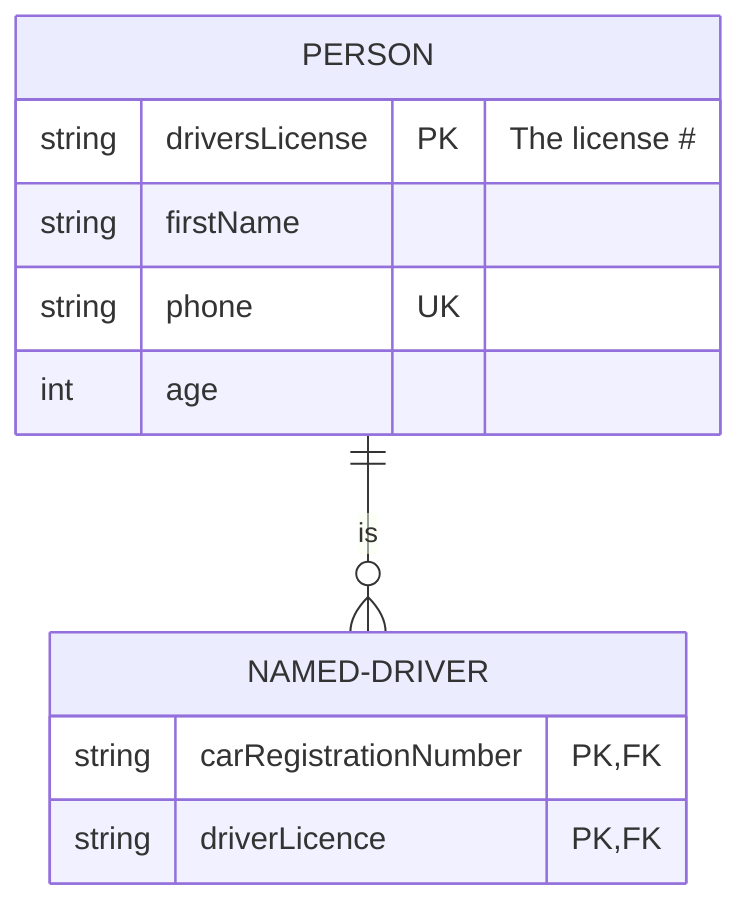
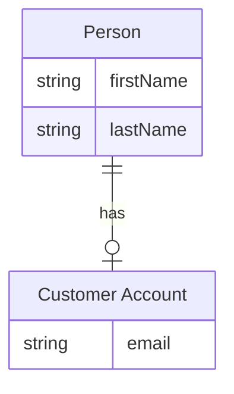
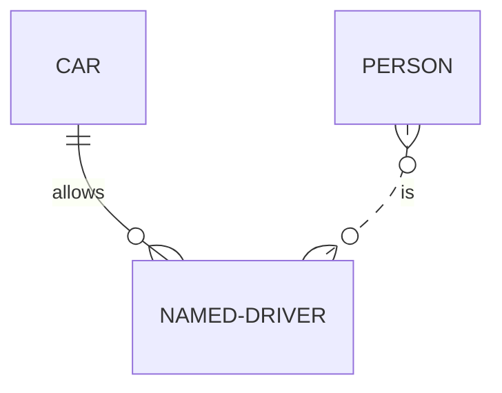
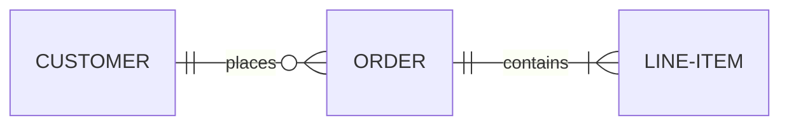
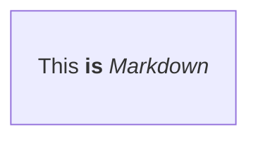
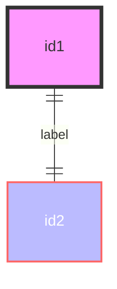
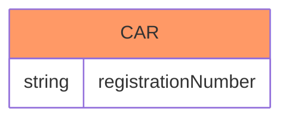
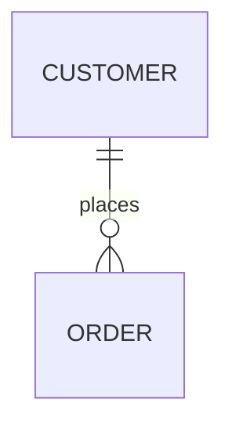

# Entity Relationship Diagram Reference

ER diagrams model entities, their attributes, and the relationships between them using crow's foot notation.

## Quick Start



## Syntax

### Basic Structure

Each statement follows this format:

```text
<first-entity> [<relationship> <second-entity> : <relationship-label>]
```

- `first-entity` — entity name (supports unicode; wrap in double quotes for spaces)
- `relationship` — cardinality markers describing how entities inter-relate
- `second-entity` — the other entity name
- `relationship-label` — describes the relationship from the first entity's perspective

Only `first-entity` is required, enabling standalone entity declarations during iterative design.

### Entities and Attributes

Define attributes inside a block delimited by `{` and `}`:



Attribute `type` must begin with an alphabetic character and may contain digits, hyphens, underscores, parentheses, and square brackets.
Attribute `name` follows the same rules, or may start with `*` to indicate a primary key.

### Attribute Keys and Comments

Attributes support `PK`, `FK`, and `UK` key constraints and inline comments:



| Key | Meaning |
| --- | ------- |
| `PK` | Primary Key |
| `FK` | Foreign Key |
| `UK` | Unique Key |

Comments use double quotes at the end of an attribute line. Multiple key constraints are separated by commas.

### Entity Name Aliases

Use square brackets to display an alias instead of the entity name:



### Relationship Syntax

A relationship consists of three sub-components: left cardinality marker, identification type, right cardinality marker.

**Cardinality markers:**

| Left | Right | Meaning |
| :---: | :---: | ------- |
| `\|o` | `o\|` | Zero or one |
| `\|\|` | `\|\|` | Exactly one |
| `}o` | `o{` | Zero or more |
| `}\|` | `\|{` | One or more |

**Identification:**

| Value | Alias | Meaning |
| :---: | :---: | ------- |
| `--` | `to` | Identifying (solid line) |
| `..` | `optionally to` | Non-identifying (dashed line) |

Word aliases like `one or zero`, `zero or more`, `only one`, `1`, `0+`, `1+` are also accepted.



### Direction

Control layout orientation with the `direction` statement:



**Options:** `TB` (top to bottom), `BT` (bottom to top), `LR` (left to right), `RL` (right to left)

### Text Formatting

Entity names and attributes support unicode and Markdown formatting:



## Styling

### Node Styling

Apply CSS styles directly to nodes:



Style multiple nodes: `style nodeId1,nodeId2 styleList`

### Classes

Define reusable style classes and apply them with `:::` or the `class` statement:



```text
classDef className fill:#f9f,stroke:#333,stroke-width:4px
class nodeId1,nodeId2 className
classDef className1,className2 font-size:12pt
```

**Default class:** A class named `default` applies to all nodes without specific class definitions.

## Configuration

### Layout

The default layout is dagre. For larger diagrams, use ELK layout:


