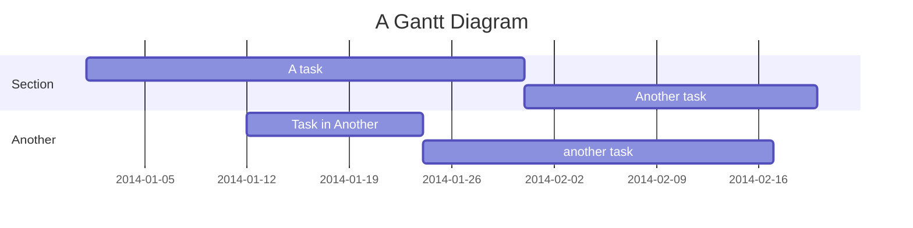
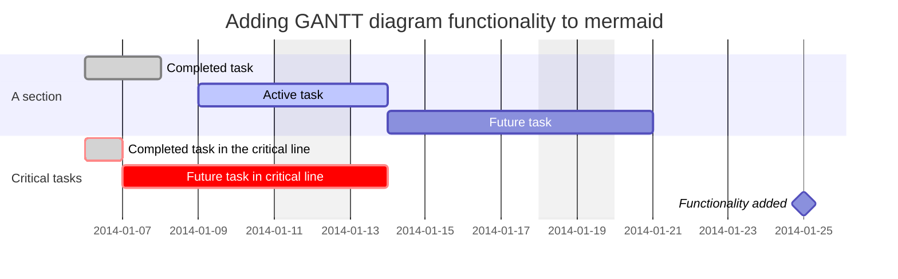
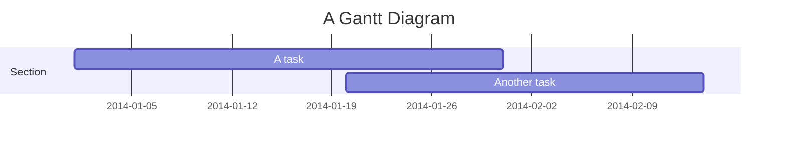
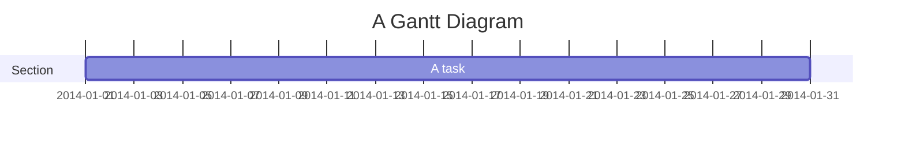

# Gantt Diagram Reference

Gantt charts illustrate project schedules as horizontal bars on a timeline, showing task durations, dependencies, and milestones.

## Quick Start



## Syntax

Tasks are sequential by default; each task starts when the preceding one ends. A colon `:` separates the task title from its metadata. Metadata items are comma-separated.

**Valid task tags:** `active`, `done`, `crit`, `milestone` — must appear first if used.

After tags, remaining metadata is interpreted as:

1. One item: end date or duration
2. Two items: start date/task-ref + end/duration
3. Three items: task ID + start + end/duration

**Task metadata syntax:**

| Syntax | Start date | End date | ID |
| ------ | ---------- | -------- | -- |
| `<taskID>, <startDate>, <endDate>` | startDate | endDate | taskID |
| `<taskID>, <startDate>, <length>` | startDate | start + length | taskID |
| `<taskID>, after <otherTaskId>, <length>` | end of otherTask | start + length | taskID |
| `<startDate>, <length>` | startDate | start + length | n/a |
| `after <otherTaskID>, <length>` | end of otherTask | start + length | n/a |
| `<length>` | end of preceding task | start + length | n/a |
| `until <otherTaskId>` | end of preceding task | start of otherTask | n/a |

### Duration Format

| Unit | Suffix | Example |
| ---- | ------ | ------- |
| Milliseconds | `ms` | `500ms` |
| Seconds | `s` | `30s` |
| Minutes | `m` | `30m` |
| Hours | `h` | `4h` |
| Days | `d` | `3d` |
| Weeks | `w` | `2w` |
| Months | `M` | `1M` |
| Years | `y` | `1y` |

Decimal values are supported (e.g., `1.5d`).

### Sections and Milestones



### Vertical Markers

Add visual reference lines with `vert`:

```mermaid
gantt
    dateFormat HH:mm
    axisFormat %H:%M
    Initial vert : vert, v1, 17:30, 2m
    Task A : 3m
    Final vert : vert, v2, 17:58, 4m
```



## Setting Dates

### Input Date Format

Default: `YYYY-MM-DD`. Set with `dateFormat`.

**Supported tokens:**

| Input | Example | Description |
| ----- | ------- | ----------- |
| `YYYY` | 2014 | 4-digit year |
| `YY` | 14 | 2-digit year |
| `MM` | 01..12 | Month number |
| `DD` | 01..31 | Day of month |
| `HH` | 00..23 | 24-hour time |
| `mm` | 00..59 | Minutes |
| `ss` | 00..59 | Seconds |
| `X` | 1410715640.579 | Unix timestamp |

### Output Axis Format

Default: `YYYY-MM-DD`. Set with `axisFormat` using d3 format tokens (e.g., `%Y-%m-%d`).

### Axis Ticks

Customize tick interval with `tickInterval` (v10.3.0+):

```text
tickInterval 1day
tickInterval 1week
```

Pattern: `/^([1-9][0-9]*)(millisecond|second|minute|hour|day|week|month)$/`

### Excludes and Weekends

```text
excludes weekends
weekend friday
```

`excludes` accepts specific dates (`YYYY-MM-DD`), day names (e.g., `sunday`), or `weekends`. Excluded dates extend task durations rather than creating gaps within tasks.

## Compact Mode

Display multiple tasks in the same row:



## Today Marker

Style or hide the current-date marker:

```text
todayMarker stroke-width:5px,stroke:#0f0,opacity:0.5
todayMarker off
```

## Comments

Lines prefaced with `%%` are ignored by the parser:



## Interactivity

Bind click events to tasks (requires `securityLevel='loose'`):

```text
click taskId call callback(arguments)
click taskId href URL
```

## Styling

**CSS classes used:**

| Class | Description |
| ----- | ----------- |
| `grid.tick` | Grid line styling |
| `grid.path` | Grid border styling |
| `.taskText` | Task text |
| `.taskTextOutsideRight` | Task text extending right |
| `.taskTextOutsideLeft` | Task text extending left |
| `todayMarker` | Today marker toggle and styling |

## Configuration

```javascript
mermaid.ganttConfig = {
  titleTopMargin: 25,
  barHeight: 20,
  barGap: 4,
  topPadding: 75,
  rightPadding: 75,
  leftPadding: 75,
  fontSize: 12,
  sectionFontSize: 24,
  numberSectionStyles: 1,
  axisFormat: '%d/%m',
  tickInterval: '1week',
  topAxis: true,
  displayMode: 'compact',
  weekday: 'sunday',
};
```
