# Mindmap Reference

Mindmaps visually organize information into a hierarchy radiating from a central concept, with branches representing related ideas.

## Quick Start

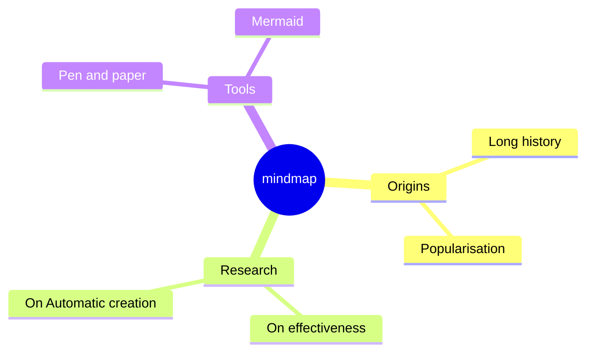

## Syntax

Hierarchy is defined by indentation. Each level of indentation creates a child node relative to the previous shallower level.

```text
mindmap
    Root
        A
            B
            C
```

The exact indentation amount does not matter — only the relative indentation compared to adjacent rows.
When indentation is ambiguous, Mermaid uses the nearest ancestor with lesser indentation as the parent.

## Node Shapes

### Square

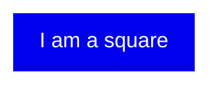

### Rounded Square

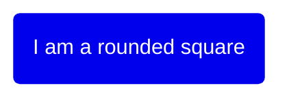

### Circle

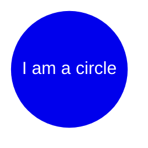

### Bang

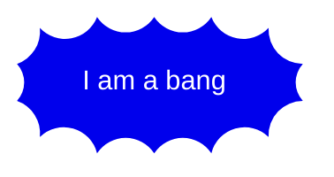

### Cloud

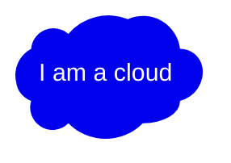

### Hexagon

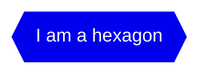

### Default

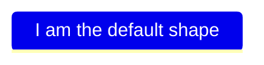

## Icons and Classes

### Icons

Add FontAwesome or Material Design icons using `::icon()` syntax on the line after the node:

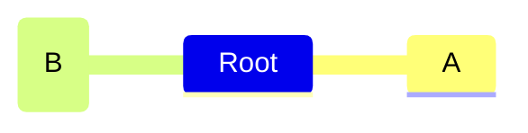

Icon fonts must be available on the page — this is configured by the site administrator.

### Classes

Apply CSS classes with `:::` followed by space-separated class names:

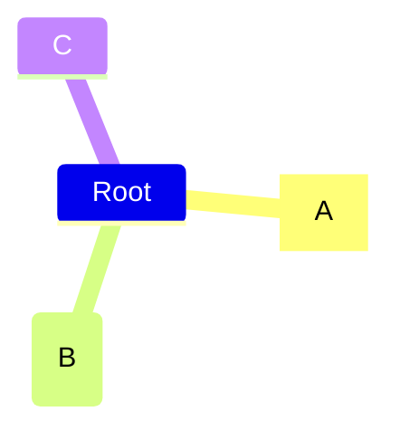

Classes must be defined in the site's CSS.

## Markdown Strings

Use backtick strings for bold, italics, and automatic text wrapping:

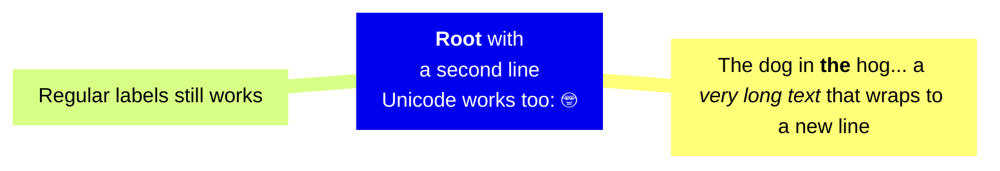

- Bold: `**text**`
- Italic: `*text*`
- Line breaks are automatic; newline characters also work

## Configuration

### Layouts

Use the tidy-tree layout for a more compact representation:

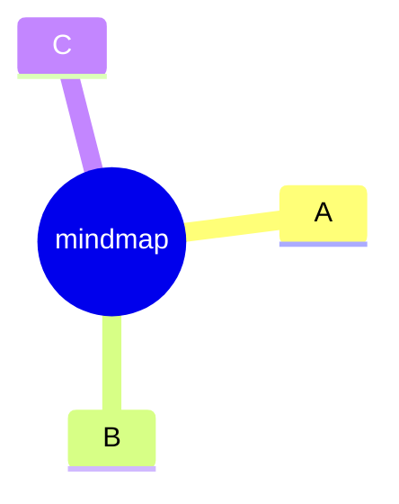
