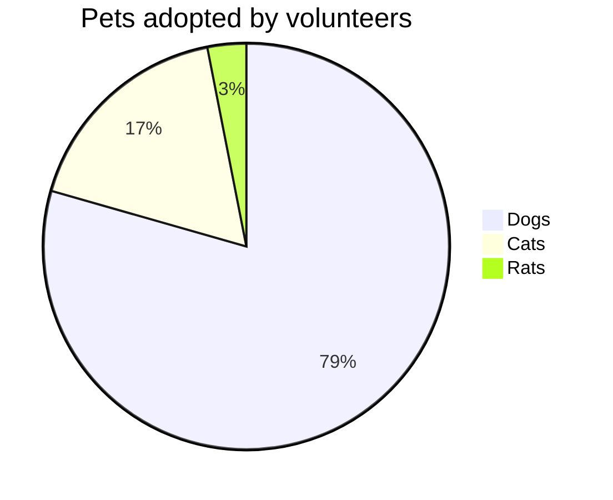
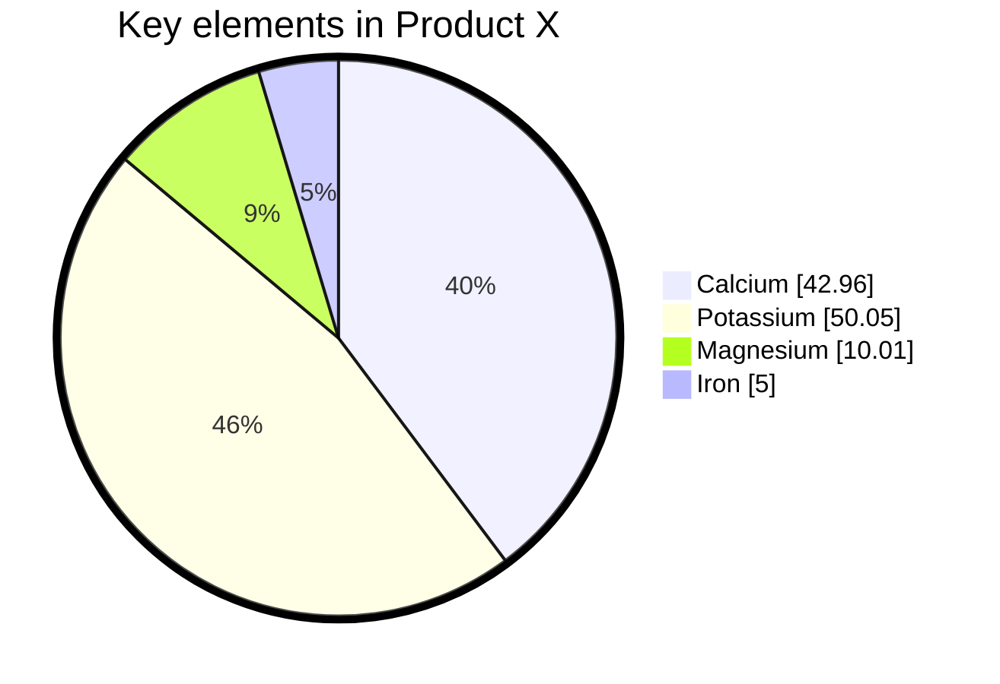

# Pie Chart Reference

Pie charts illustrate numerical proportions as slices of a circle, with each slice's arc length proportional to the value it represents.

## Quick Start



## Syntax

```text
pie [showData]
    [title <titleText>]
    "<label>" : <value>
    "<label>" : <value>
```

- Start with the `pie` keyword
- `showData` — optional; renders actual values after legend text
- `title` — optional; sets the chart title
- Labels are quoted strings, values are positive numbers (up to two decimal places)
- Slices are ordered clockwise in the order labels are defined

All values must be **positive numbers greater than zero**.

## Example with Configuration



## Configuration

| Parameter | Description | Default |
| --------- | ----------- | ------- |
| `textPosition` | Axial position of slice labels (0.0 = center, 1.0 = outer edge) | `0.75` |
