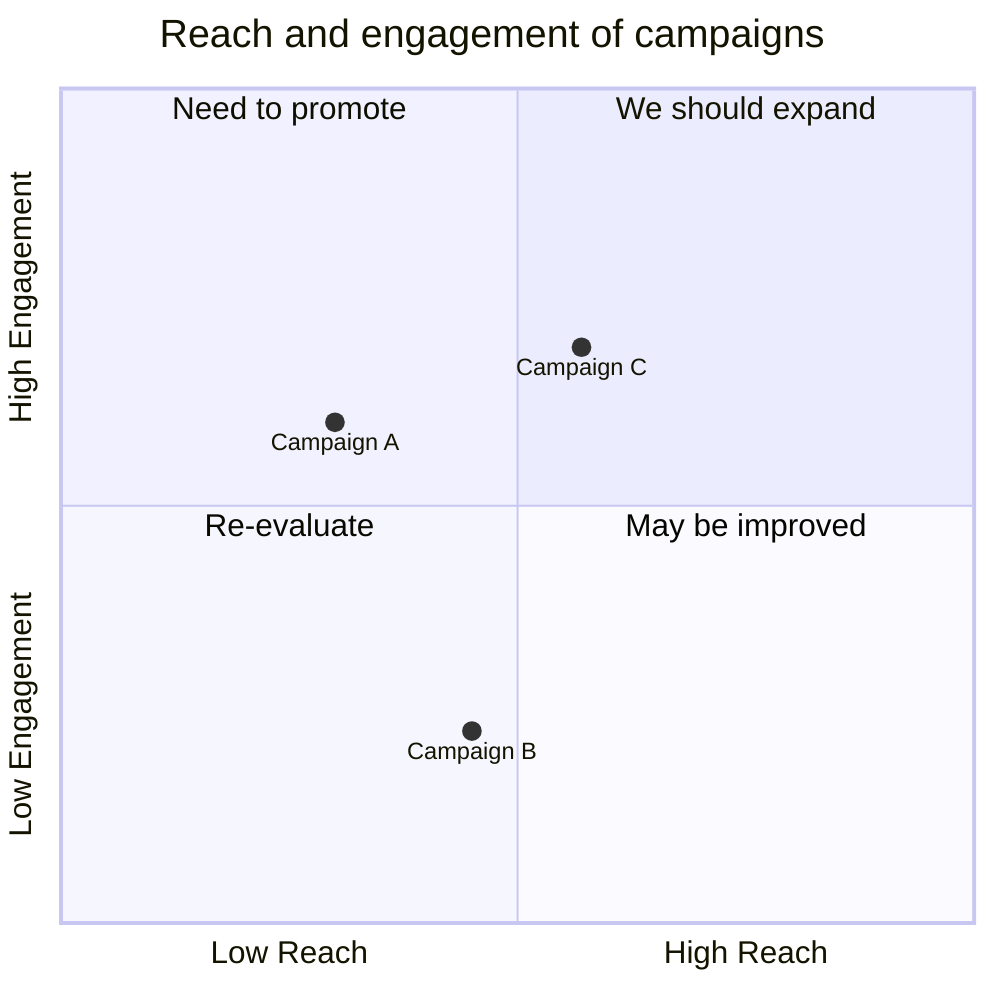
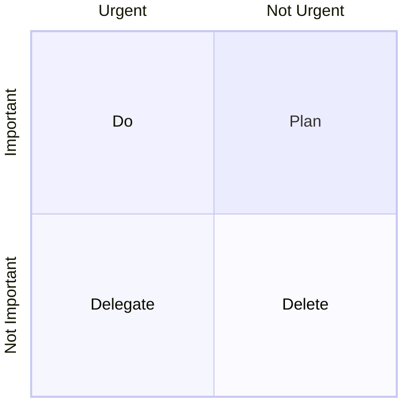

# Quadrant Chart Reference

Quadrant charts plot data points on a two-dimensional grid divided into four quadrants, useful for prioritization and pattern analysis.

## Quick Start



## Syntax

### Title

```text
quadrantChart
    title This is a sample example
```

The title renders at the top of the chart.

### Axes

**x-axis** — left and right labels separated by `-->`:

1. `x-axis <text> --> <text>` — renders both left and right labels
2. `x-axis <text>` — renders only the left label

**y-axis** — bottom and top labels separated by `-->`:

1. `y-axis <text> --> <text>` — renders both bottom and top labels
2. `y-axis <text>` — renders only the bottom label

### Quadrant Labels

```text
quadrant-1 <text>    (top right)
quadrant-2 <text>    (top left)
quadrant-3 <text>    (bottom left)
quadrant-4 <text>    (bottom right)
```

When no points are present, labels render in the center of each quadrant. When points are present, axis labels shift to the chart edges and quadrant labels shift to the top of each quadrant.

### Points

Plot circles using `<text>: [x, y]` where both `x` and `y` are in the range 0–1:

```text
Point 1: [0.75, 0.80]
Point 2: [0.35, 0.24]
```

## Point Styling

### Direct Styling

```text
Campaign A: [0.9, 0.0] radius: 12
Campaign B: [0.8, 0.1] color: #ff3300, radius: 10
Campaign C: [0.7, 0.2] radius: 25, color: #00ff33, stroke-color: #10f0f0
```

### Class Styling

```text
Campaign A:::class1: [0.9, 0.0]
classDef class1 color: #109060
classDef class2 color: #908342, radius: 10, stroke-color: #310085, stroke-width: 10px
```

**Available style properties:**

| Property | Description |
| -------- | ----------- |
| `color` | Fill color of the point |
| `radius` | Radius of the point |
| `stroke-width` | Border width of the point |
| `stroke-color` | Border color of the point |

Style priority: direct styles > class styles > theme styles.

## Configuration

| Parameter | Description | Default |
| --------- | ----------- | :-----: |
| `chartWidth` | Width of the chart | 500 |
| `chartHeight` | Height of the chart | 500 |
| `titlePadding` | Top and bottom padding of the title | 10 |
| `titleFontSize` | Title font size | 20 |
| `quadrantPadding` | Padding outside all quadrants | 5 |
| `quadrantLabelFontSize` | Quadrant text font size | 16 |
| `quadrantInternalBorderStrokeWidth` | Border stroke width inside quadrants | 1 |
| `quadrantExternalBorderStrokeWidth` | Quadrant external border stroke width | 2 |
| `xAxisLabelFontSize` | X-axis text font size | 16 |
| `xAxisPosition` | Position of x-axis (`top` or `bottom`) | `'top'` |
| `yAxisLabelFontSize` | Y-axis text font size | 16 |
| `yAxisPosition` | Position of y-axis (`left` or `right`) | `'left'` |
| `pointRadius` | Radius of plotted points | 5 |
| `pointLabelFontSize` | Point text font size | 12 |

## Theme Variables

| Variable | Description |
| -------- | ----------- |
| `quadrant1Fill` | Fill color of top right quadrant |
| `quadrant2Fill` | Fill color of top left quadrant |
| `quadrant3Fill` | Fill color of bottom left quadrant |
| `quadrant4Fill` | Fill color of bottom right quadrant |
| `quadrant1TextFill` | Text color of top right quadrant |
| `quadrant2TextFill` | Text color of top left quadrant |
| `quadrant3TextFill` | Text color of bottom left quadrant |
| `quadrant4TextFill` | Text color of bottom right quadrant |
| `quadrantPointFill` | Points fill color |
| `quadrantPointTextFill` | Points text color |
| `quadrantXAxisTextFill` | X-axis text color |
| `quadrantYAxisTextFill` | Y-axis text color |
| `quadrantInternalBorderStrokeFill` | Inner border color |
| `quadrantExternalBorderStrokeFill` | Outer border color |
| `quadrantTitleFill` | Title color |

## Configuration Example


