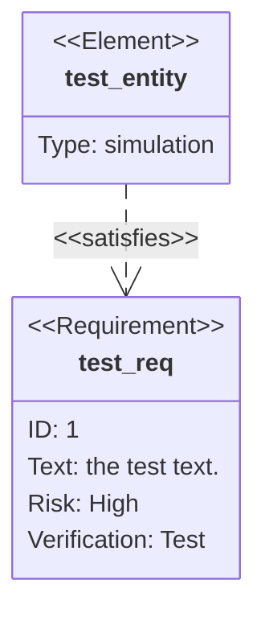
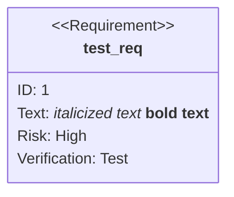
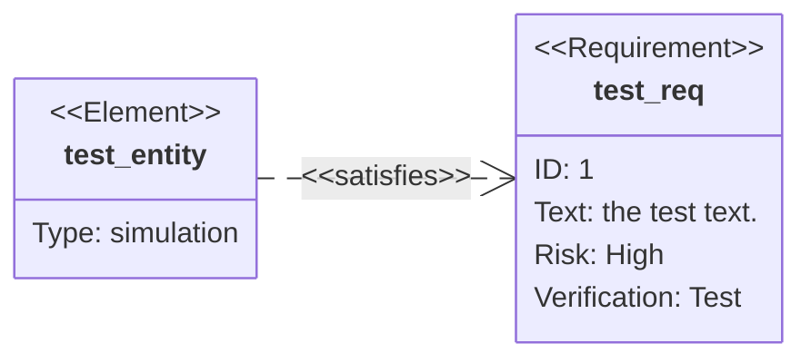
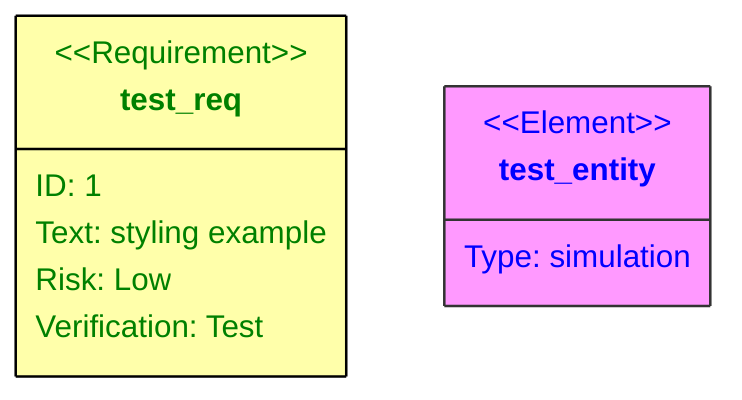
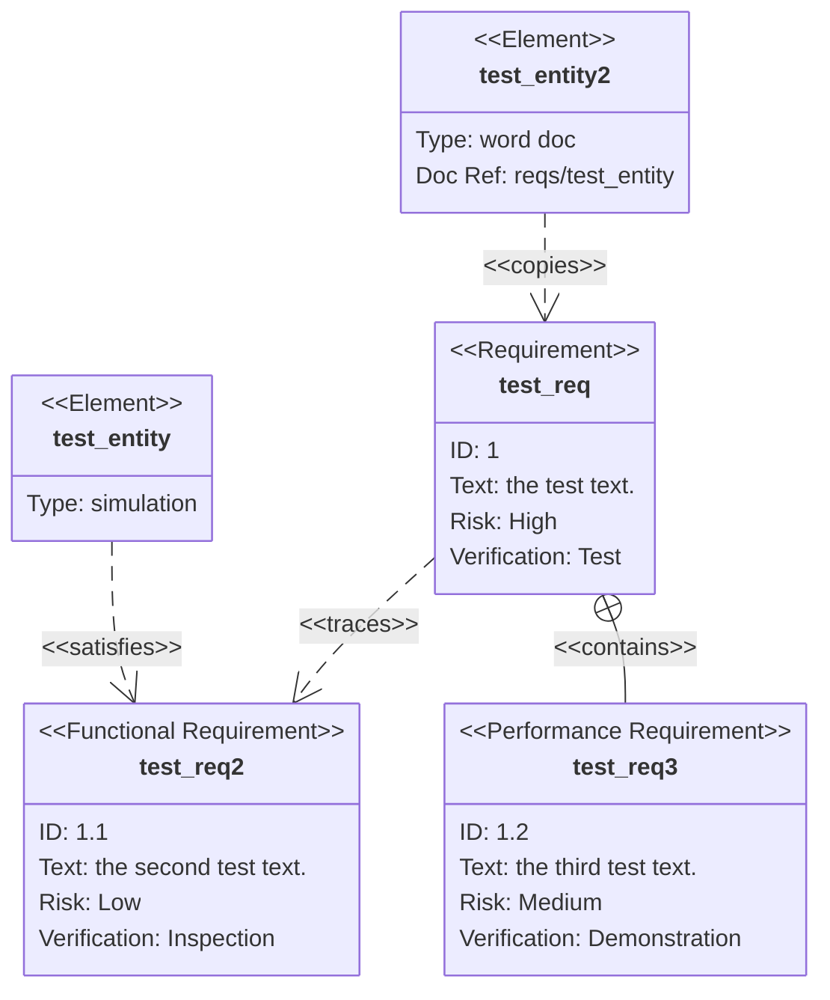

# Requirement Diagram Reference

Requirement diagrams visualize requirements and their connections to each other and to other documented elements, following SysML v1.6 modeling specs.

## Quick Start



## Syntax

There are three component types: requirements, elements, and relationships.

User-defined text can be quoted or unquoted. Quoted text supports Markdown formatting.

### Requirements

```text
<type> user_defined_name {
    id: user_defined_id
    text: user_defined text
    risk: <risk>
    verifymethod: <method>
}
```

| Keyword | Options |
| ------- | ------- |
| Type | `requirement`, `functionalRequirement`, `interfaceRequirement`, `performanceRequirement`, `physicalRequirement`, `designConstraint` |
| Risk | `Low`, `Medium`, `High` |
| VerificationMethod | `Analysis`, `Inspection`, `Test`, `Demonstration` |

### Elements

```text
element user_defined_name {
    type: user_defined_type
    docref: user_defined_ref
}
```

Elements are lightweight and intended to connect requirements to portions of other documents.

### Relationships

```text
{source} - <type> -> {destination}
{destination} <- <type> - {source}
```

Relationship types: `contains`, `copies`, `derives`, `satisfies`, `verifies`, `refines`, `traces`

Each relationship is labeled in the diagram.

### Markdown Formatting



## Direction

Control layout with the `direction` statement:



**Options:** `TB` (default), `BT`, `LR`, `RL`

## Styling

### Direct Styling



### Class Definitions

```text
classDef important fill:#f96,stroke:#333,stroke-width:4px
classDef test fill:#ffa,stroke:#000
```

**Default class:** A class named `default` applies to all nodes.

### Applying Classes

Apply with the `class` keyword:

```text
class test_req,test_entity important
```

Apply with `:::` shorthand during definition:

```text
requirement test_req:::important {
    id: 1
    text: class styling example
    risk: low
    verifymethod: test
}
```

Or after definition:

```text
test_elem:::myClass
```

## Full Example


