# State Diagram Reference

State diagrams describe system behavior through states and the transitions between them.

## Quick Start

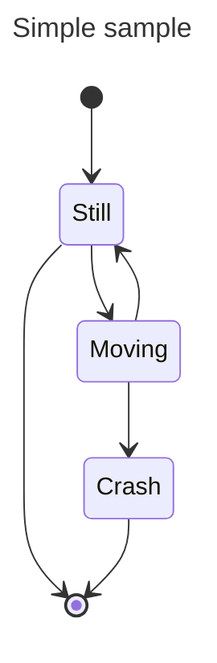

Use `stateDiagram-v2` for the current renderer. The older `stateDiagram` keyword uses a legacy renderer.

## States

### Defining States

States can be defined by ID alone:

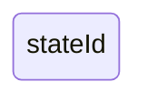

Or with a description using the `state` keyword:

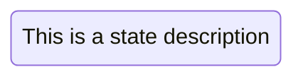

Or using `id : description` syntax:


## Transitions

Transitions are represented with `-->`. When states referenced in a transition are not yet defined, they are created implicitly:

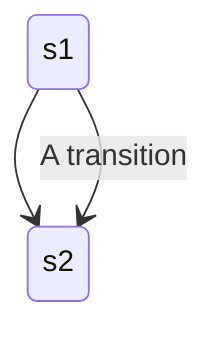

## Start and End

`[*]` represents start and end states. The direction of the transition determines whether it is a start or stop:

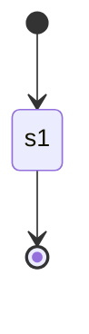

## Composite States

Composite states contain internal states defined within `{}`:

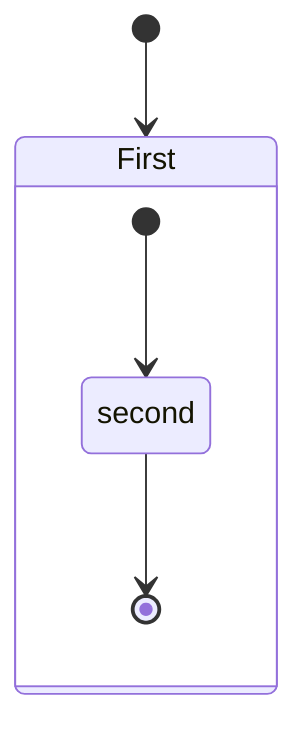

Composite states support multiple nesting levels. Transitions between internal states of different composite states are not allowed.

## Choice

Model branching with `<<choice>>`:

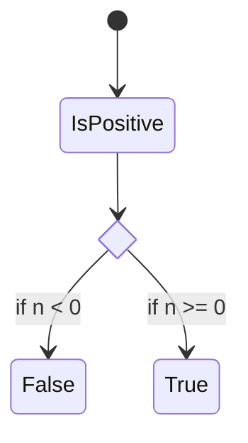

## Forks and Joins

Represent parallel execution with `<<fork>>` and `<<join>>`:

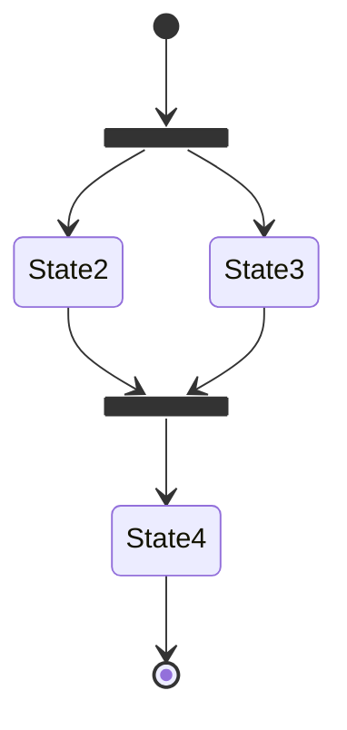

## Notes

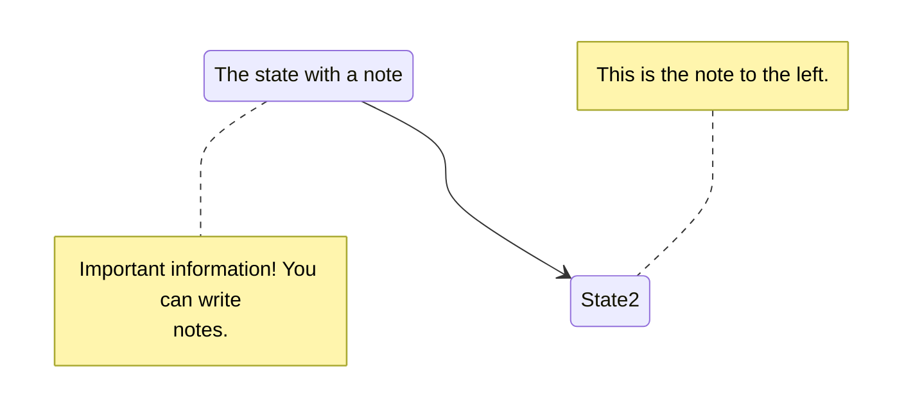

## Concurrency

Use `--` to separate concurrent regions within a composite state:

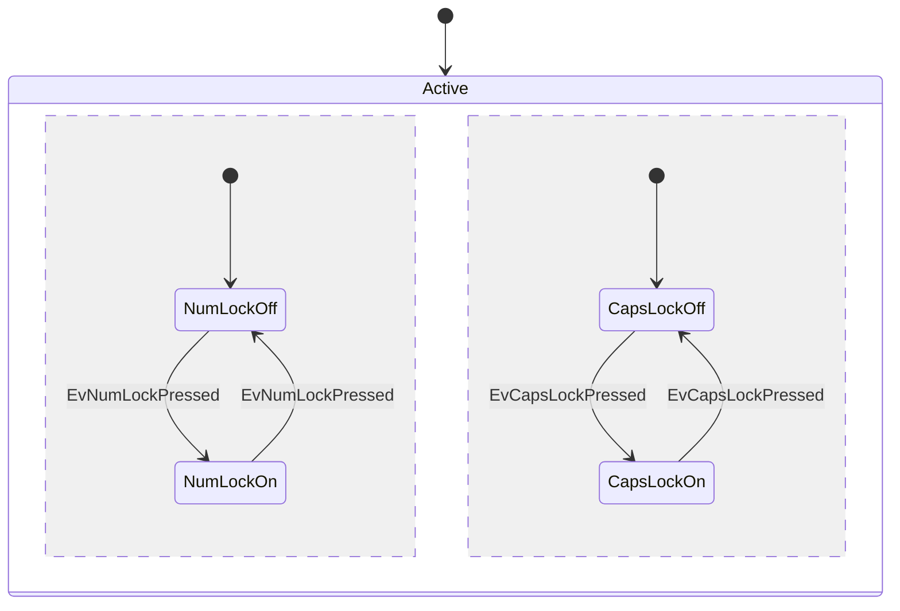

## Direction

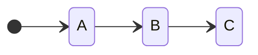

**Options:** `TB` (default), `BT`, `LR`, `RL`

Direction can also be set per composite state.

## Comments

Lines prefaced with `%%` are ignored by the parser:

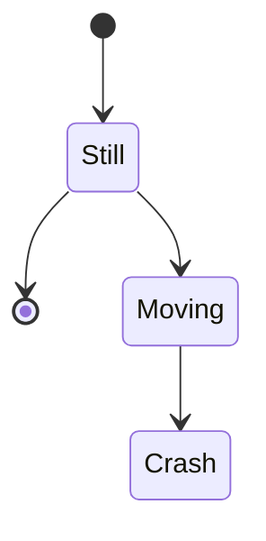

## Styling with classDefs

Define styles with `classDef` and apply to states:

```text
classDef movement font-style:italic
classDef badBadEvent fill:#f00,color:white,font-weight:bold,stroke-width:2px,stroke:yellow
```

**Limitations:** classDefs cannot be applied to start/end states or within composite states.

**Apply with `class` statement:**

```text
class Moving, Crash movement
class Crash badBadEvent
```

**Apply with `:::` operator:**

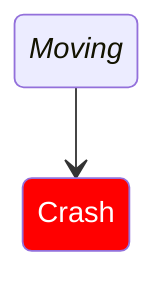
