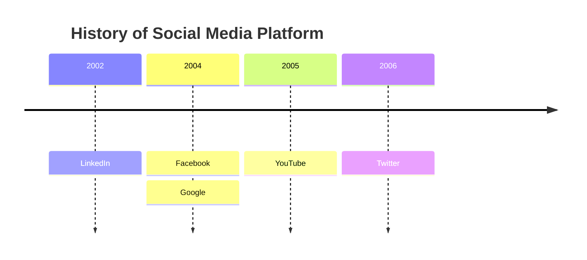
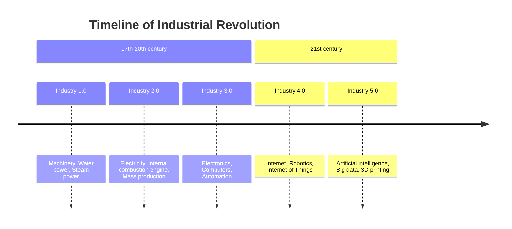
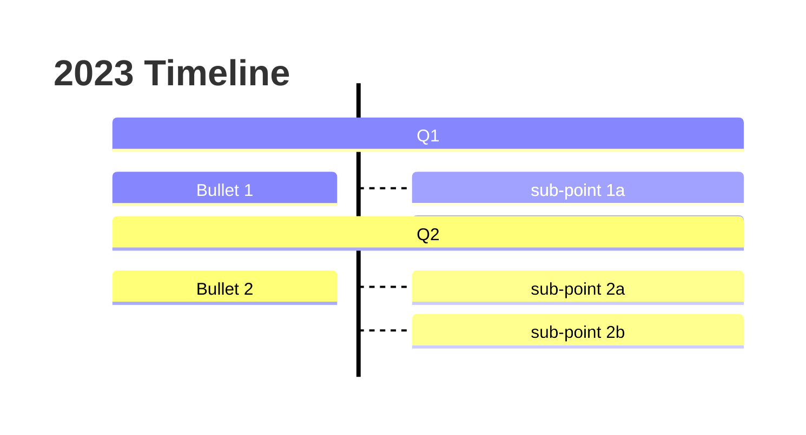
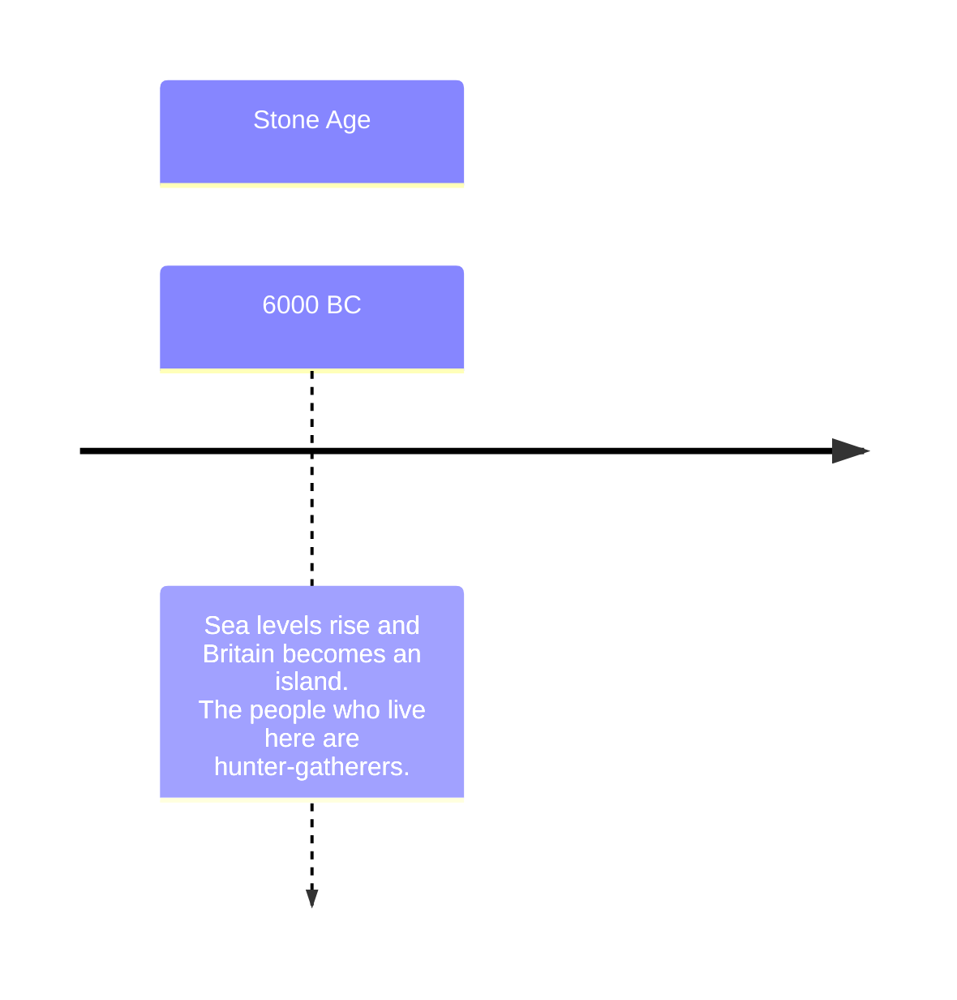
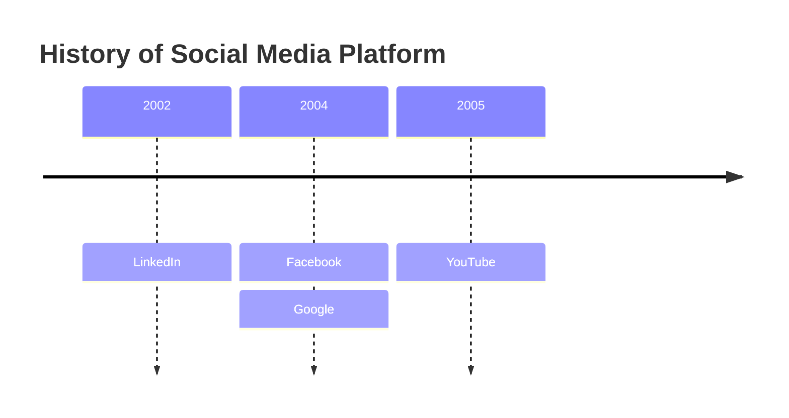
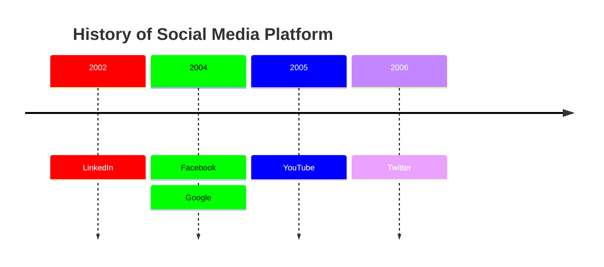

# Timeline Reference

Timelines illustrate a chronology of events, dates, or periods of time arranged along a horizontal (or vertical) axis.

## Quick Start



## Syntax

```text
timeline [direction]
    [title <text>]
    <time-period> : <event>
    <time-period> : <event> : <event>
```

- Start with the `timeline` keyword
- Optional `title` on the next line
- Each line begins with a time period followed by `:` and one or more events
- Time periods and events are plain text — not limited to numbers
- Multiple events for one period can be on the same line (`2004 : Facebook : Google`) or separate lines

## Sections

Group time periods into named sections:



All periods within a section share a color scheme. Without sections, each time period gets its own color (default behavior).

## Direction

Control orientation with a direction keyword after `timeline` (v11.14.0+):



**Options:** `LR` (left to right, default), `TD` (top to bottom)

## Text Wrapping

Long text wraps automatically. Use `<br>` to force a line break:



## Styling

### Disabling Multi-Color

By default, each time period or section uses a distinct color. To use a single color scheme:



### Custom Color Scheme

Override section colors using `cScale0` through `cScale11` theme variables. `cScaleLabel0`–`cScaleLabel11` control foreground colors:



More than 12 sections repeat the color scheme.
