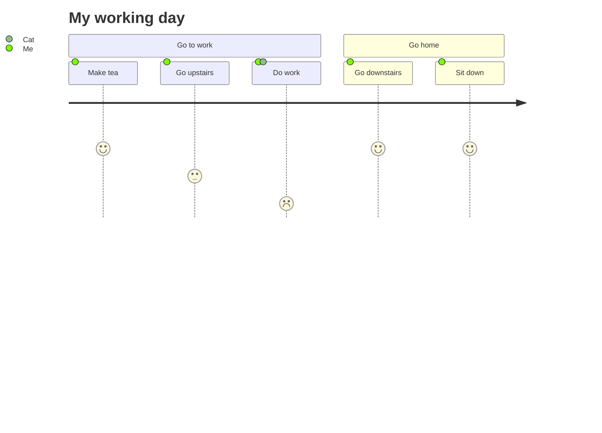

# User Journey Diagram Reference

User journey diagrams describe the steps different users take to complete a specific task within a system, showing experience scores per step.

## Quick Start



## Syntax

```text
journey
    title <title>
    section <section name>
      <task name>: <score>: <actor1>, <actor2>
```

- Start with the `journey` keyword
- `title` sets the diagram title
- `section` groups related tasks
- Each task uses the format: `Task name: <score>: <comma-separated actors>`

**Score:** a number from 1 to 5 (inclusive) indicating how positive the experience is for the user.

Tasks are grouped visually under their section. Each actor gets a dedicated swim lane in the diagram.
